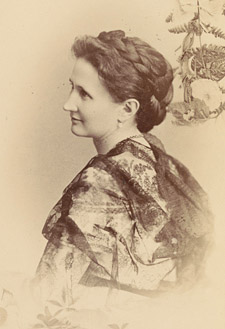

# jennie

   

A Slack bot used internally by the Cornell Chimes, aimed at keeping track of logistical matters. It is named after the namesake of the home of the Chimes (McGraw Tower), Jennie McGraw

## Installation

Jennie is highly customized to the Cornell Chimes Slack. However, these would be the steps that a new Slack would need to take at a base level, assuming all of the channel names remained the same (largely taken from [here](https://slack.dev/bolt-python/tutorial/getting-started#create-an-app)):

- [Create a new Slack App](https://api.slack.com/apps/new) from scratch
  - Navigate to the **OAuth & Permissions**, and in **Bot Token Scopes**, click **Add a OAuth Scope** and give Jennie `chat:write` access
  - Scroll to the top of the **OAuth & Permissions** page, and click **Install App To Workspace**. Once completed, you'll see a **Bot User OAuth Access Token**; note this as `bot-token`.
  - Head to **Basic Information**, and under **App-Level Tokens**, click **Generate Token And Scopes**. Name this token however you wish; however, it should have access to the `connections:write` scope. Note the generated token as `app-token`
  - In **Event Subscriptions**, under **Subscribe to bot events**, subscribe to `message.channels`, `message.groups`, `message.im`, and `message.mpim`. You may need to re-install the app after saving.
  - In **Socket Mode**, make sure that socket mode is enabled.
  - Under **Basic Information**, feel free to customize the display name and picture!
- Create an Environment File
  - In the main directory, create a file named `.env`. It should have 2 lines; one with `SLACK_BOT_TOKEN=bot-token`, and one with `SLACK_APP_TOKEN=app-token`, with `bot-token` and `app-token` being replaced with the values noted earlier
